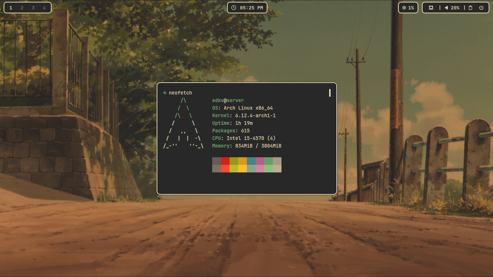
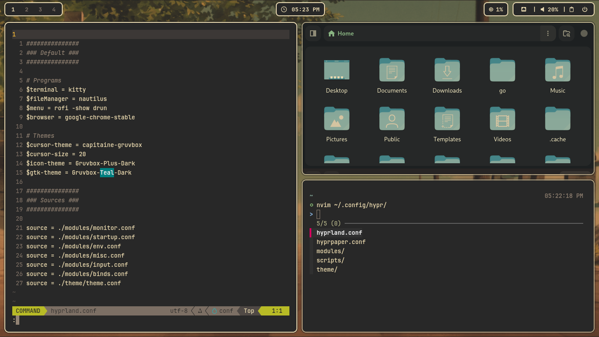
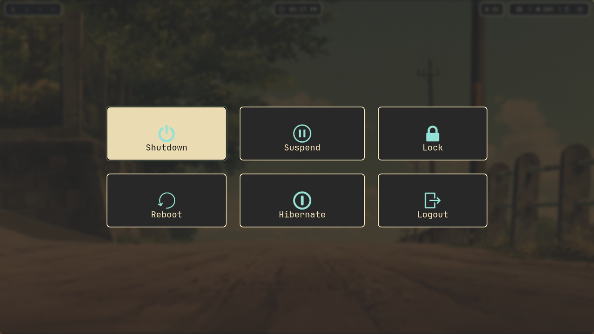

# edkv's Hyprland 💧

Gruvbox like but ytta!

For more details or issues, please visit the repository’s [issues page](https://github.com/eedkv/dotfiles/issues).

## Installation

Soon..

## Details

- OS: **[Arch Linux](https://github.com/archlinux)**
- DE: **[Hyprland](https://github.com/hyprwm/Hyprland)**
- Terminal: **[Kitty](https://github.com/kovidgoyal/kitty)**
- Shell: **[zsh](https://github.com/zsh-users/zsh)**
- App Launcher: **[Rofi](https://github.com/davatorium/rofi)**
- Editor: **[Neovim](https://github.com/neovim/neovim)**

## Screenshots

