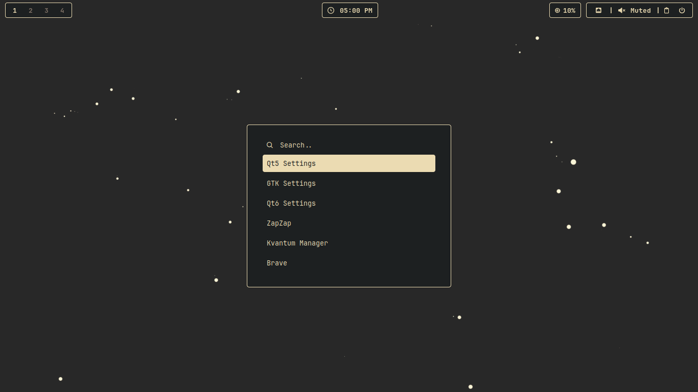
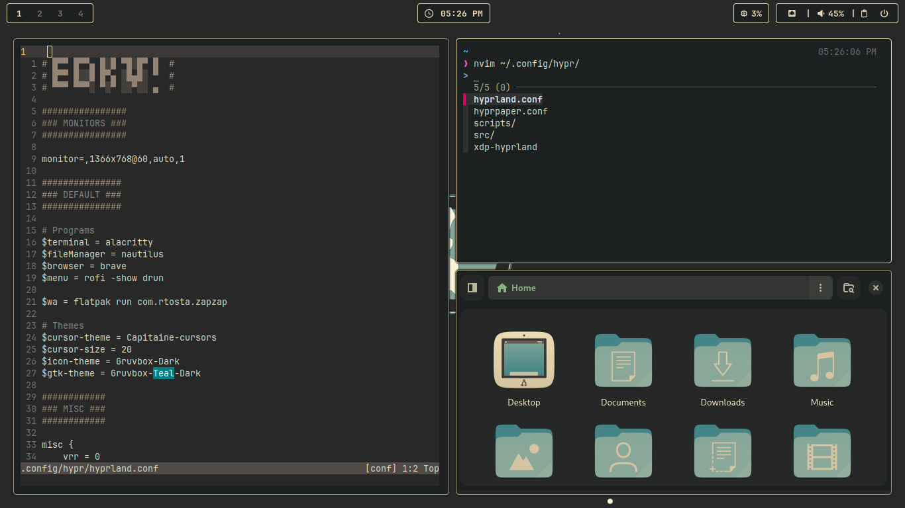
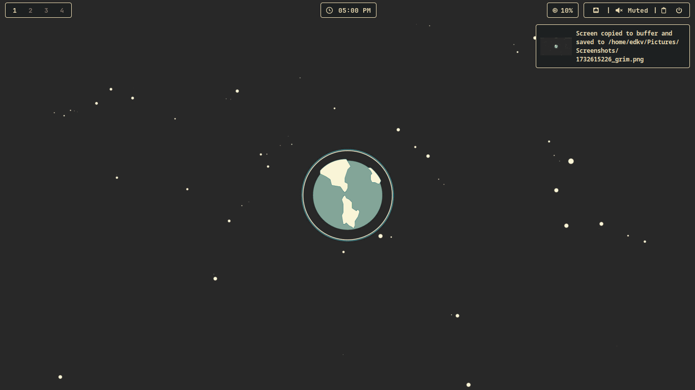
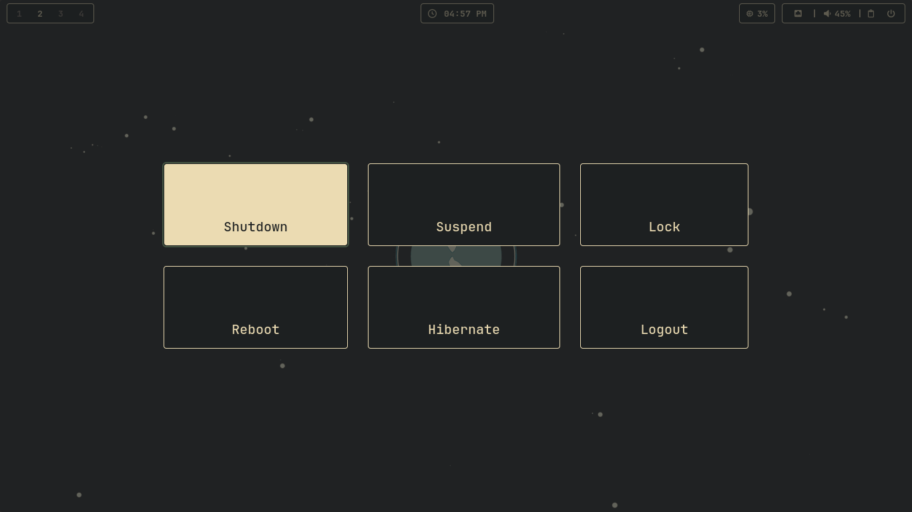

    <h1> edkv's Hyprland dotfiles </h1>
    <h3><i> like gruvbox but ytta </i></h3>

 

 

</a>

## required packages

- Hyprland, Hyprpaper, Hyprpicker
- alacritty
- Rofi `rofi-wayland`
- Dunst
- Waybar
- Wlogout
- nwg-look
- brave-bin
- polkit-gnome 
- neovim
- zsh
- tmux
